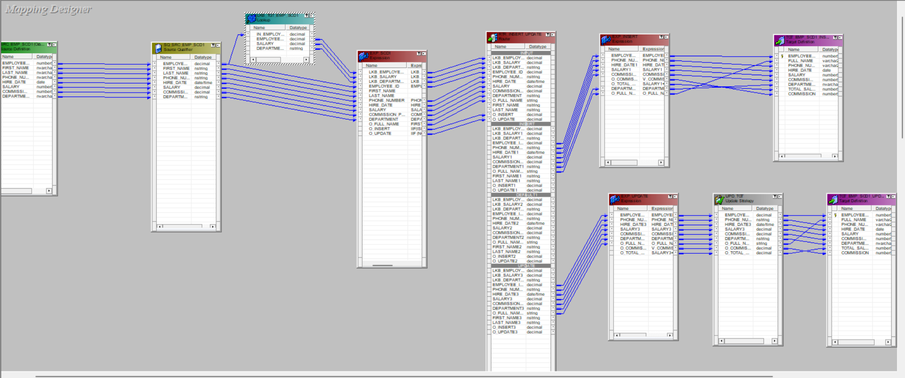
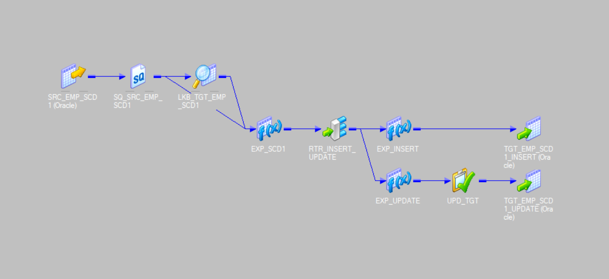

# ETL Process for SCD Type 1 Implementation in Informatica PowerCenter

## 1. Overview

This ETL process implements Slowly Changing Dimension (SCD) Type 1 in Informatica PowerCenter to load employee data from a source table (Oracle Database) into a target table (Oracle Database). SCD Type 1 keeps the most recent information and overwrites old data with new values, thus eliminating historical tracking.

### 2. Data Flow Diagram

## 3. Source and Target Tables

### Source Table (Oracle Database)

| Column Name     | Description                        |
|-----------------|------------------------------------|
| employee_id     | Unique identifier for the employee |
| first_name      | Employee's first name              |
| last_name       | Employee's last name               |
| phone_number    | Employee's phone number            |
| hire_date       | Employee's hire date               |
| salary          | Employee's salary                  |
| commission_pct  | Employee's commission percentage   |
| department      | Employee's department              |

### Target Table (Oracle Database)

| Column Name     | Description                                               |
|-----------------|-----------------------------------------------------------|
| employee_id     | Unique identifier for the employee                        |
| full_name       | Concatenation of `first_name` and `last_name`              |
| phone_number    | Employee's phone number                                   |
| hire_date       | Employee's hire date                                      |
| commission_pct  | Employee's commission percentage                          |
| commission      | Calculated as `commission_pct * salary`                   |
| total_salary    | Calculated as `salary + commission`                       |
| department      | Employee's department                                     |

## 4. ETL Process Steps

### Step 1: Source and Source Qualifier

- The process begins with the **Source Transformation**, which fetches data from the Oracle source table.
- The **Source Qualifier** is applied to filter the data based on the given conditions (if any).

### Step 2: Lookup Transformation

- A **Lookup Transformation** is used to match `employee_id` from the source table with the `employee_id` from the target table.
- Return values for the columns `salary` and `department` (which are expected to change).
- The output of the Lookup is prefixed with `LKB_` (e.g., `LKB_SALARY`, `LKB_DEPARTMENT`).

### Step 3: Expression Transformation

- The **Expression Transformation** uses the columns from the source and the returned columns from the Lookup transformation.
- Additional output fields are created:
  - `O_fullname`: Concatenation of `first_name` and `last_name`.
  - `O_insert`: Flag to identify rows for insertion (calculated as `IIF(ISNULL(LKB_EMPLOYEE_ID), 1, 0)`).
  - `O_update`: Flag to identify rows for updates (calculated as `IIF(NOT ISNULL(LKB_EMPLOYEE_ID) AND (LKB_SALARY != SALARY OR LKB_DEPARTMENT != DEPARTMENT), 1, 0)`).

### Step 4: Router Transformation

- A **Router Transformation** is used to separate data into two paths:
  - **Insert Path**: When `O_insert = 1`, the data is routed for insertion into the target table.
  - **Update Path**: When `O_update = 1`, the data is routed for updating existing records in the target table.

### Step 5: Expression Transformation for Insert Path

- **Expression Transformation** for the Insert Path:
  - Input columns: `employee_id1`, `phone_number1`, `O_fullname1`, `hire_date1`, `salary1`, `commission_pct1`, `department1`.
  - A new variable port `V_commission` is created as `IIF(ISNULL(COMMISSION_PCT1), 0, SALARY1 * COMMISSION_PCT1)`.
  - Output ports: `O_commission` (calculated commission) and `O_total_salary` (salary + commission).
  - Map these values to the target table for the insert operation.

### Step 6: Expression Transformation for Update Path

- **Expression Transformation** for the Update Path:
  - Input columns: Same as the Insert Path but with suffix 3 (e.g., `employee_id3`, `phone_number3`).
  - Use the same logic for commission and total salary calculation.
  - An **Update Strategy Transformation** is used to mark records for update (when `DD_update = 1`).

### Step 7: Mapping to Target Table

- Both the **Insert** and **Update** paths are mapped to the target table.
- Insert rows are added, and existing rows are updated with new values.

## 5. Test Cases for Data Insertion and Update

### Test Case 1: Initial Data Load

- **Objective**: Perform an initial data load to the target table.
- **Data**: Insert 7 employees into the source table.

| employee_id | first_name | last_name  | phone_number | salary | hire_date   | commission_pct | department |
|-------------|------------|------------|--------------|--------|-------------|----------------|------------|
| 1           | JOHN       | DOE        | 123-456-7890 | 5000   | 01-JAN-22   | 0.05           | HR         |
| 2           | JANE       | SMITH      | 234-567-8901 | 6000   | 15-JUN-21   | 0.07           | IT         |
| 3           | ALICE      | JOHNSON    | 345-678-9012 | 7000   | 20-MAR-20   | 0.04           | MARKETING  |
| 4           | BOB        | BROWN      | 456-789-0123 | 5500   | 10-AUG-23   | 0.03           | SALES      |
| 5           | CAROL      | DAVIS      | 567-890-1234 | 6500   | 05-NOV-22   | 0.02           | FINANCE    |
| 6           | DAVID      | MARTIN     | 678-901-2345 | 7500   | 25-JAN-21   | 0.06           | HR         |
| 7           | EMMA       | WILSON     | 789-012-3456 | 8000   | 12-JUL-19   | 0.05           | IT         |

**Expected Outcome**: All 7 rows should be inserted into the target table without any updates.

### Target After First Run

### Test Case 2: Insertion of New Employees

- **Objective**: Insert two new employees.
- **New Data**:

| employee_id | first_name | last_name | phone_number | salary | hire_date   | commission_pct | department   |
|-------------|------------|-----------|--------------|--------|-------------|----------------|--------------|
| 8           | LOKA       | AREF      | 128-835-5572 | 10000  | 15-JUL-22   | 0.09           | ETL          |
| 9           | VENOM      | DEHA      | 101-072-1210 | 11000  | 05-NOV-20   | 0.08           | AI           |

**Expected Outcome**: These two employees should be inserted into the target table.

### Test Case 3: Update Existing Employees

- **Objective**: Update two existing employees with new salary and department values.
- **Updated Data**:

| employee_id | salary | department  |
|-------------|--------|-------------|
| 3           | 8000   | SALES       |
| 1           | 9000   | MANAGEMENT  |

**Expected Outcome**: The records for Jim Halpert and Michael Scott should be updated in the target table with new salary and department values.

## 6. Final Data in Target Table (After 2nd Run)

## 7. Conclusion

This ETL process using Informatica PowerCenter successfully implements SCD Type 1, ensuring that the most up-to-date employee information is stored in the target table. The process is efficient, reliable, and easily scalable for future expansions.
