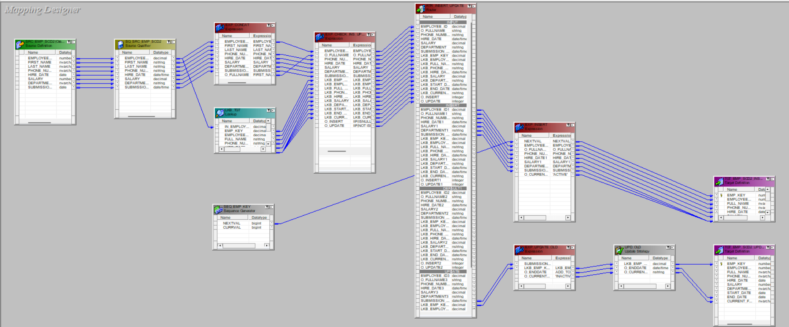
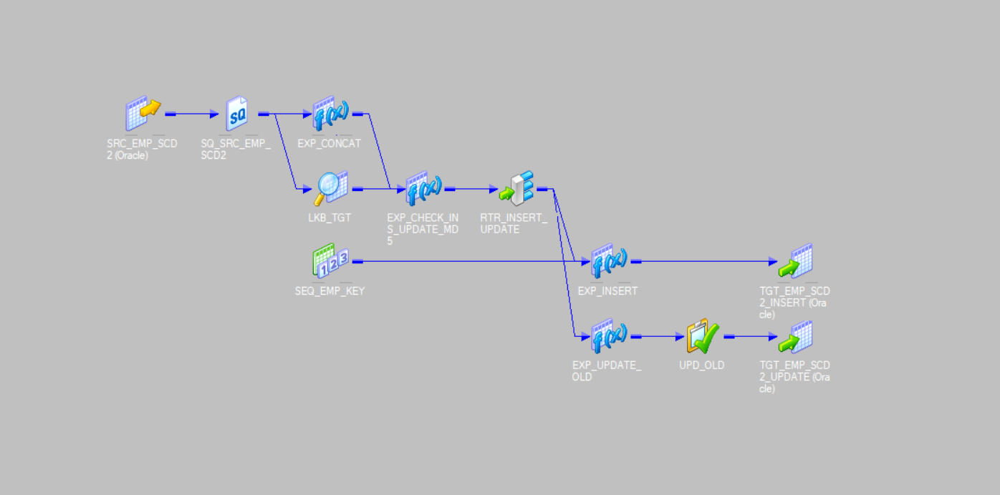
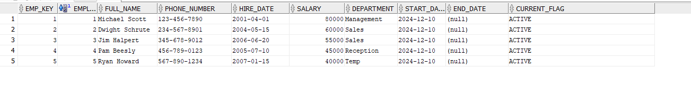
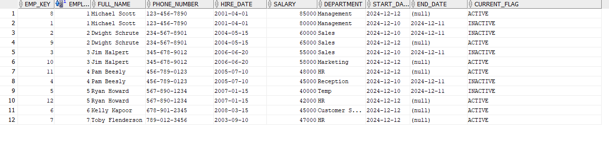
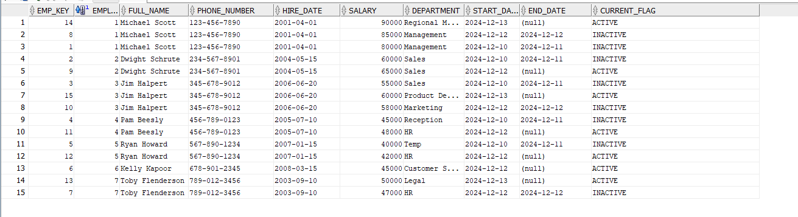

# SCD Type 2 Implementation Using Informatica PowerCenter

## Objective

To implement Slowly Changing Dimension (SCD) Type 2 in Informatica PowerCenter, which tracks historical changes in employee data while maintaining a full history of changes.

## Understanding SCD Type 2

Slowly Changing Dimension Type 2 is used when it is necessary to track and store the historical changes of dimension data over time. The logic involves the following steps:

### 1. New Records (Inserts)

- If a record from the source does not exist in the target, it is inserted as a new record with:
  - `current_flag = "active"`
  - `start_date` indicating when it became effective.

### 2. Updated Records

- If a record from the source exists in the target but has changes, the following occurs:
  - The existing record is marked as inactive (`current_flag = "inactive"`) and its `end_date` is set to one day before the new record's `start_date`.
  - A new record is inserted with the updated values, `current_flag = "active"`, and the `start_date` reflecting when the changes take effect.

### 3. Unchanged Records

- If a record from the source matches an existing record in the target, no changes are made.

The SCD Type 2 mechanism ensures that every version of a record is preserved in the target table, allowing for historical reporting.

### 1. Data Flow Diagram





## 2. Source Table

**Table Name**: `SRC_EMP_SCD2`

| Column Name      | Description                               |
|------------------|-------------------------------------------|
| `employee_id`    | Unique identifier for each employee      |
| `first_name`     | First name of the employee                |
| `last_name`      | Last name of the employee                 |
| `phone_number`   | Phone number of the employee              |
| `hire_date`      | Date the employee was hired               |
| `salary`         | Salary of the employee                    |
| `department`     | Department the employee works in          |
| `submission_date`| Date the record is being submitted/updated|

## 3. Target Table

**Table Name**: `TGT_EMP_SCD2`

| Column Name      | Description                               |
|------------------|-------------------------------------------|
| `emp_key`        | Surrogate key (auto-generated)            |
| `employee_id`    | Employee's unique identifier              |
| `full_name`      | Full name (concatenation of first_name and last_name) |
| `phone_number`   | Phone number of the employee              |
| `hire_date`      | Date the employee was hired               |
| `salary`         | Salary of the employee                    |
| `department`     | Department the employee works in          |
| `start_date`     | Date the record became effective          |
| `end_date`       | Date the record was superseded (NULL for active records) |
| `current_flag`   | Indicates if the record is "active" or "inactive" |

## 4.ETL Process Steps

### Step 1. Source and Source Qualifier

The mapping starts by reading data from the source table `SRC_EMP_SCD2` through a **Source Qualifier** transformation.

### Step 2. Expression Transformation: `EXP_CONCAT`

- **Objective**: Concatenate `first_name` and `last_name` into `full_name`.
- **Output**: `O_Fullname`

```plaintext
O_Fullname = CONCAT(first_name, last_name)
```

### Step 3. Lookup Transformation: `LKB_TGT`

- **Objective**: Perform a lookup on the target table `TGT_EMP_SCD2`.
- **Input**: `employee_id` from the source table.
- **Output**: All fields from the target table, prefixed with `LKB_`.
- **Condition**:

```plaintext
employee_id (source) = employee_id (target).
```

### Step 4. Expression Transformation for Logic and MD5 Hash: `EXP_Insert_Update`

#### Variable Fields

- **`V_SRC_MD5`**: MD5 hash for columns from the source:

  ```plaintext
  MD5(employee_id || O_Fullname || phone_number || salary || department)
  ```

- **`V_LKB_MD5`:** MD5 hash for columns from the lookup:

  ```plaintext
  MD5(LKB_employee_id || LKB_full_name || LKB_phone_number || LKB_salary || LKB_department)
  ```

#### Output Fields

- **`O_insert`**: Determines if the row is new or has changes:

  ```plaintext
  IIF(ISNULL(LKB_emp_key) OR (V_SRC_MD5 != V_LKB_MD5), 1, 0)
  ```

- **`O_update`**: Determines if the existing record needs updating:

  ```plaintext
  IIF(NOT ISNULL(LKB_emp_key) AND (V_SRC_MD5 != V_LKB_MD5), 1, 0)
  ```

#### Input & Output Fields

 All Feilds from LKB_TGT and EXP_Insert_Update

### Step 5. Router Transformation

Contains two groups:

- **Insert Group**: `O_insert = 1`
- **Update Group**: `O_update = 1`

### Step 6. Insert Path

#### From Insert Group

- **Fields**: `employee_id`, `O_Fullname`, `phone_number`, `hire_date`, `salary`, `department`, `submission_date`
- These fields go to an **Expression Transformation** (`EXP_INSERT`).
- Surrogate key is generated using a **Sequence Generator**.
- `current_flag` is set to "active" by default.
- The data is then mapped to the target table `TGT_EMP_SCD2`.

### Step 7. Update Path

#### From Update Group

- **Fields**: `LKB_emp_key`, `submission_date` go to an **Expression Transformation** (`EXP_UPDATE_OLD`):
  - **`O_enddate`**:

    ```plaintext
    ADD_TO_DATE(submission_date, 'DD', -1)
    ```

  - **`O_currentflag`**: "inactive"
  
- Outputs (`LKB_emp_key`, `O_enddate`, `O_currentflag`) are passed to an **Update Strategy Transformation** with the expression `DD_UPDATE`.
- These fields are updated in the target table `TGT_EMP_SCD2`.

## 5. Test Cases

### Test Case 1 - First Load

This is the first load where 5 employees are inserted into the target table.

| employee_id | first_name | last_name | phone_number | hire_date  | salary | department | submission_date |
|-------------|------------|-----------|--------------|------------|--------|------------|-----------------|
| 1           | Michael    | Scott     | 123-456-7890 | 2001-04-01 | 80000  | Sales      | 2024-12-01      |
| 2           | Dwight     | Schrute   | 234-567-8901 | 2004-05-15 | 60000  | Sales      | 2024-12-01      |
| 3           | Jim        | Halpert   | 345-678-9012 | 2006-06-20 | 50000  | HR         | 2024-12-01      |
| 4           | Pam        | Beesly    | 456-789-0123 | 2005-07-10 | 45000  | HR         | 2024-12-01      |
| 5           | Ryan       | Howard    | 567-890-1234 | 2007-01-15 | 40000  | Marketing  | 2024-12-01      |

### Target After First Run



### Test Case 2 - Second Load

In the second load, two new employees are added, and the salary and department of the five existing employees are updated.

| employee_id | first_name | last_name | phone_number | hire_date  | salary | department        | submission_date |
|-------------|------------|-----------|--------------|------------|--------|-------------------|-----------------|
| 1           | Michael    | Scott     | 123-456-7890 | 2001-04-01 | 85000  | Management        | 2024-12-12      |
| 2           | Dwight     | Schrute   | 234-567-8901 | 2004-05-15 | 65000  | Sales             | 2024-12-12      |
| 3           | Jim        | Halpert   | 345-678-9012 | 2006-06-20 | 58000  | Marketing         | 2024-12-12      |
| 4           | Pam        | Beesly    | 456-789-0123 | 2005-07-10 | 48000  | HR                | 2024-12-12      |
| 5           | Ryan       | Howard    | 567-890-1234 | 2007-01-15 | 42000  | HR                | 2024-12-12      |
| 6           | Kelly      | Kapoor    | 678-901-2345 | 2008-03-15 | 45000  | Customer Service  | 2024-12-13      |
| 7           | Toby       | Flenderson| 789-012-3456 | 2003-09-10 | 47000  | HR                | 2024-12-12      |

### Target After Second Run



### Test Case 3 - Third Load

In the third load, the departments and salaries for Michael, Jim, Pam, and Toby are updated.

| employee_id | first_name | last_name | phone_number | hire_date  | salary | department        | submission_date |
|-------------|------------|-----------|--------------|------------|--------|-------------------|-----------------|
| 1           | Michael    | Scott     | 123-456-7890 | 2001-04-01 | 90000  | Regional Manager  | 2024-12-13      |
| 2           | Dwight     | Schrute   | 234-567-8901 | 2004-05-15 | 65000  | Sales             | 2024-12-13      |
| 3           | Jim        | Halpert   | 345-678-9012 | 2006-06-20 | 60000  | Product Development | 2024-12-13      |
| 4           | Pam        | Beesly    | 456-789-0123 | 2005-07-10 | 48000  | HR                | 2024-12-13      |
| 5           | Ryan       | Howard    | 567-890-1234 | 2007-01-15 | 42000  | HR                | 2024-12-13      |
| 6           | Kelly      | Kapoor    | 678-901-2345 | 2008-03-15 | 45000  | Customer Service  | 2024-12-13      |
| 7           | Toby       | Flenderson| 789-012-3456 | 2003-09-10 | 50000  | Legal             | 2024-12-13      |

### Target After Third Run



### Conclusion

This document provides the complete mapping and test cases for implementing SCD Type 2 in Informatica PowerCenter.
