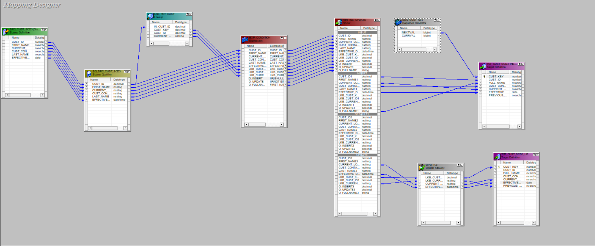
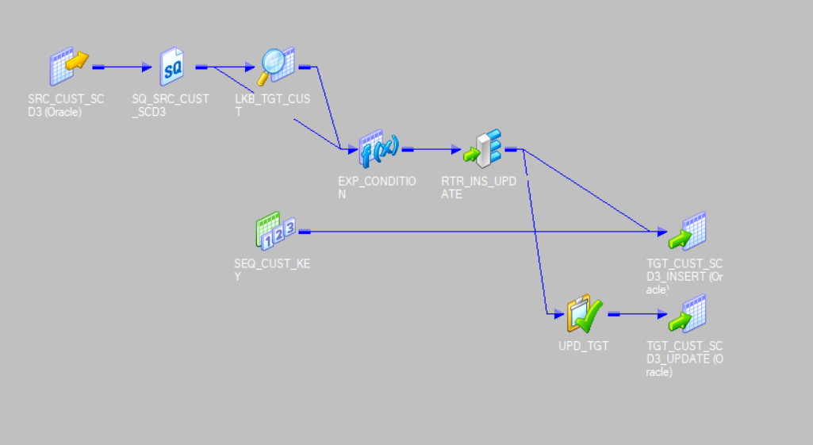
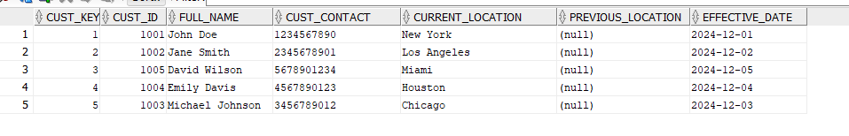
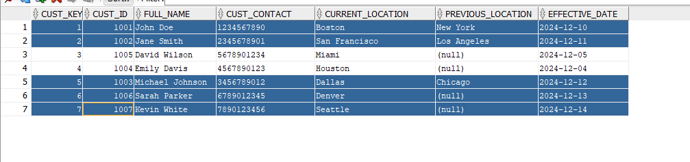
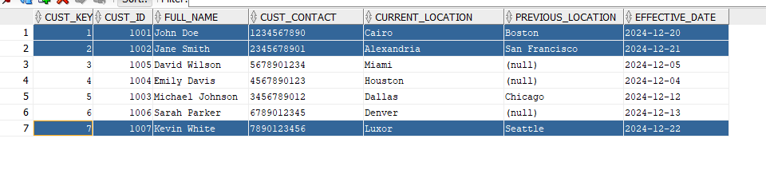

# Implementing SCD Type 3 in Informatica PowerCenter

### Overview of SCD Type 3

Slowly Changing Dimension (SCD) Type 3 is used to track and store limited historical data in a data warehouse. This technique stores the previous value of a column (or columns) in the target table, allowing you to track only the changes within a limited time frame. For example, in this case, we track a customer's current and previous location. When a customer's location changes, we store the new location as `current_location` and the old one as `previous_location`. This approach is typically used when the number of changes is small and historical accuracy isn't as critical as with SCD Type 2.

---

### Data Flow Diagram

---

### 1. Source Table (`SRC_CUST_SCD3`)

This table holds the data coming from the source system and represents the customer's information before any transformations.

| **Field Name**     | **Data Type** | **Description**                              |
|--------------------|---------------|----------------------------------------------|
| `cust_id`          | string/int    | Customer Identifier.                        |
| `first_name`       | string        | Customer's first name.                      |
| `last_name`        | string        | Customer's last name.                       |
| `cust_contact`     | string        | Customer's contact information.             |
| `cust_location`    | string        | Customer's location (which can change).     |
| `effective_date`   | date          | Date when the record is effective.          |

---

### 2. Target Table (`TGT_CUST_SCD3`)

This table stores the final transformed data, where we track the customer's current and previous locations.

| **Field Name**     | **Data Type** | **Description**                              |
|--------------------|---------------|----------------------------------------------|
| `cust_key`         | integer       | Surrogate key to uniquely identify the record. |
| `cust_id`          | string/int    | Customer Identifier.                        |
| `full_name`        | string        | Concatenation of `first_name` and `last_name`. |
| `cust_contact`     | string        | Customer's contact information.             |
| `current_location` | string        | Customer's current location.                |
| `previous_location`| string        | Customer's previous location (tracked for changes). |
| `effective_date`   | date          | Date when the record is effective.          |

---

### 3. Mapping Process

#### Step 1: Source and Source Qualifier Transformation

- Data flows from `SRC_CUST_SCD3` through a **Source Qualifier Transformation**, which extracts all fields from the source table.

---

#### Step 2: Lookup Transformation (`LKP_TARGET`)

- **Input**: `cust_id` from the source.  
- **Lookup Condition**: `cust_id (source) = cust_id (target)`  
- **Returns Fields**:  
  - `cust_id`  
  - `cust_key`  
  - `current_location`  
- **Prefix**: Fields from the lookup are prefixed with `LKB_` (e.g., `LKB_CUST_KEY`, `LKB_CURRENT_LOCATION`).

---

#### Step 3: Expression Transformation (`EXP_CONDITION`)

- **Input**: Fields from the Source Qualifier and Lookup transformations.  
- **Output Fields Created**:  
  - `O_Fullname`: `CONCAT(first_name, last_name)`  
  - `O_insert`: `IIF(ISNULL(LKB_CUST_KEY), 1, 0)` (marks rows for insertion).  
  - `O_update`: `IIF(NOT ISNULL(LKB_CUST_KEY) AND (CURRENT_LOCATION != LKB_CURRENT_LOCATION), 1, 0)` (marks rows for updating).

---

#### Step 4: Router Transformation

- **Groups**:  
  - **Insert Group**: `O_insert = 1`  
  - **Update Group**: `O_update = 1`  

---

#### Step 5: Insert Path

- Fields from the **Insert Group**:  
  - `cust_id`  
  - `O_Fullname`  
  - `cust_contact`  
  - `cust_location`  
  - `effective_date`  

- **Sequence Transformation**: Generates a surrogate key for `cust_key`.  
- **Mapping to Target Table**:  
  - `cust_key` → Generated by Sequence Transformation.  
  - `cust_id`, `full_name`, `cust_contact`, `current_location`, and `effective_date` → Directly mapped.  
  - `previous_location` → Set to `NULL`.

---

#### Step 6: Update Path

- Fields from the **Update Group**:  
  - `LKB_CUST_KEY`  
  - `CURRENT_LOCATION` (new location from source).  
  - `LKB_CURRENT_LOCATION` (old location from lookup).  

- **Update Strategy Transformation**:  
  - Expression: `DD_UPDATE`  

- **Mapping to Target Table**:  
  - `LKB_CUST_KEY` → `cust_key`  
  - `CURRENT_LOCATION` → `current_location`  
  - `LKB_CURRENT_LOCATION` → `previous_location`
  - `effective_date` → `effective_date`

---

# SCD Type 3 Implementation Test Cases

### Test Case 1: **Initial Load of Customer Records**

#### Scenario

- Insert new records into the source table for the first time.
- This will simulate the first load into the system for new customers with their initial location data.

#### Data to be inserted into the **Source Table** (`SRC_CUST_SCD3`)

| **cust_id** | **first_name** | **last_name** | **cust_contact** | **cust_location** | **effective_date** |
|-------------|----------------|---------------|------------------|-------------------|--------------------|
| 1001        | John           | Doe           | 1234567890       | Boston            | 2024-12-10         |
| 1002        | Jane           | Smith         | 2345678901       | San Francisco     | 2024-12-11         |
| 1003        | Michael        | Johnson       | 3456789012       | Chicago           | 2024-12-12         |
| 1004        | Emily          | Davis         | 4567890123       | New York          | 2024-12-13         |
| 1005        | Brian          | Wilson        | 5678901234       | Los Angeles       | 2024-12-14         |

#### Explanation

- This test case simulates the insertion of new customer records into the source table for the first time. Each record has a customer ID, full name, contact details, location, and an `effective_date`.
- These records will be processed through the SCD Type 3 transformation logic where new records will be inserted into the target table with their initial location as the `current_location`.

### Target After First Run

---

### Test Case 2: **Update Existing Customer Records and Insert New Records**

#### Scenario

- Update the first three records in the source table, changing their locations, and add two new records to simulate a more recent data update.
- This test case will ensure that the update and insert logic works for both existing and new customers.

#### Data to be inserted into the **Source Table** (`SRC_CUST_SCD3`)

| **cust_id** | **first_name** | **last_name** | **cust_contact** | **cust_location**  | **effective_date** |
|-------------|----------------|---------------|------------------|--------------------|--------------------|
| 1001        | John           | Doe           | 1234567890       | Boston             | 2024-12-15         |
| 1002        | Jane           | Smith         | 2345678901       | San Francisco      | 2024-12-16         |
| 1003        | Michael        | Johnson       | 3456789012       | Dallas             | 2024-12-17         |
| 1006        | Sarah          | Parker        | 6789012345       | Denver             | 2024-12-18         |
| 1007        | Kevin          | White         | 7890123456       | Seattle            | 2024-12-19         |

#### Explanation

- **John Doe**'s location is updated to "Boston" from the previous location. The `current_location` will be updated, and the previous location will be saved as "Boston."
- **Jane Smith**'s location is updated to "San Francisco" from her original location. The `current_location` will be updated, and the previous location will be stored.
- **Michael Johnson**'s location is updated to "Dallas".
- Two new records for **Sarah Parker** and **Kevin White** are added to the source table with their respective data. These will be inserted as new records in the target table.

### Target After Second Run

---

### Test Case 3: **Update Customer Records with New Locations**

#### Scenario

- Update two of the customer records (John Doe and Jane Smith) with new locations and add Kevin White with a new location.
- This test case verifies that the `current_location` and `previous_location` are updated correctly for these records.

#### Data to be inserted into the **Source Table** (`SRC_CUST_SCD3`)

| **cust_id** | **first_name** | **last_name** | **cust_contact** | **cust_location**  | **effective_date** |
|-------------|----------------|---------------|------------------|--------------------|--------------------|
| 1001        | John           | Doe           | 1234567890       | Cairo              | 2024-12-20         |
| 1002        | Jane           | Smith         | 2345678901       | Alexandria         | 2024-12-21         |
| 1007        | Kevin          | White         | 7890123456       | Luxor              | 2024-12-22         |

#### Explanation

- **John Doe**'s record is updated to have a `current_location` of "Cairo" and a `previous_location` of "Boston". The `effective_date` is updated to 2024-12-20.
- **Jane Smith**'s record is updated to have a `current_location` of "Alexandria" and a `previous_location` of "San Francisco". The `effective_date` is updated to 2024-12-21.
- **Kevin White**'s record is updated to have a `current_location` of "Luxor" and a `previous_location` of "Seattle". The `effective_date` is updated to 2024-12-22.
- This test case verifies that the updates to the `current_location` and `previous_location` work correctly, and new data is inserted as expected.

### Target After Third Run

---

### Summary

This process captures both new records and updates existing records by maintaining a historical trail of customer locations. SCD Type 3 allows you to track the most recent and previous values for a given column, making it ideal for situations where only limited historical data is needed.
